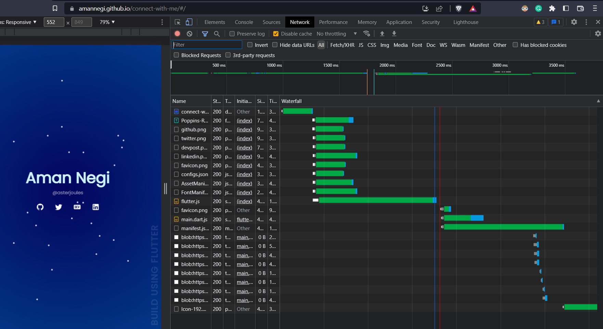

# ConnectWithMe

> Available live [here](https://amannegi.github.io/connect-with-me/)

A Flutter webpage that simply displays all my socials with intriguing animations. The web page uses a single animation controller to achieve the animation of all the particles and the source code of the particles project, can be found in the project itself. The particle animation will also be later released as an open-source plugin.

## Modifications During MLH GHW Feb 2023

The loading time has been significantly reduced by using `HTML-renderer` and `preloading` specific files which cause the delay.

Note, that now the execution is parallel the main delay is due to the slow serving from the server i.e (GitHub Server). If we host it on a paid server the webpage will be loaded quickly.
